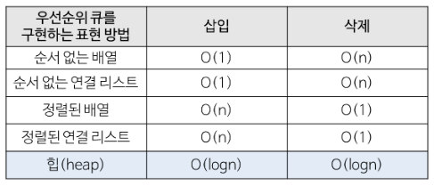

# 우선순위 큐

큐(Queue)는 데이터를 추가한 순서대로 제거하는 선입선출(FIFO) 특성을 가진 자료구조이다.

우선순위 큐는 큐와 달리 데이터 추가는 어떤 순서로 해도 상관이 없지만, 제거할 때는 **우선순위가 높은 데이터가 먼저 나가는 특성**을 가지는 자료구조이다.

우선순위 큐는 일반적으로 **힙(Heap)을 이용하여 구현**한다.

### Heap

#### 힙(Heap)이란?

- 힙은 완전 이진 트리의 일종으로 **우선순위 큐를 위해 만들어진 자료구조**이다.

- 여러 개의 값들 중 최소 값이나 최대 값을 빠르게 찾아내기에 용이하다.
- 힙은 **반정렬 상태를 유지**한다. 
  - 간단히 말하면 부모 노드의 키 값이 자식 노드의 키 값보다 항상 크거나(Max Heap), 작아야(Min Heap)한다.

#### 최대 힙

#### 최소 힙

#### 우선순위 큐의 push

- 맨 끝 위치에 값을 저장
- 부모 노드와 비교하며, 조건을 만족하는 지 확인
  - 만족하지 않는다면, 서로 위치를 변경

예시) 아래 그림 예시는 최소힙 부모노드와 비교했을때 더 작으면 위치 변경하면 된다. 최대힙은 반대로 부모와 비교해 자식이 크면 위치 변경

#### 우선순위 큐의 pop

- 가장 우선순위가 높은 값을 삭제
- 맨 끝의 노드를 비어있는 루트 노드로 끌어옴
- 루트 노드의 자식 노드들과 값을 비교, 위치 변경
  - 위치를 만족할 때까지 자식 노드와 위치를 변경하며 올바른 위치까지 이동

! 알아두면 좋을 것 !

우선순위 큐는 배열과 연결리스트로도 구현이 가능하다. 

하지만 배열과 연결리스트는 선형 구조의 자료구조이므로 삽입 또는 삭제 연산을 위한 시간 복잡도는 `O(N)`이다.  반면 힙트리는 완전이진트리 구조이므로 힙트리의 높이는 `O(logN)`이며, 힙의 시간복잡도는 `O(logN)`이다.

배열로 구현한다고 가정하면 우선순위가 높은 것은 앞에 바로 배치하면 되지만 우선순위가 중간 쯤에 있는 것은 자리를 찾아 그 뒤에 데이터의 인덱스를 하나씩 다 밀어야 하는 단점이 있다.

넣을 자리를 탐색할 때 최악의 경우에는 모든 인덱스를 탐색해야 할 수도 있다.

연결리스트도 마찬가지다.

하지만 힙의 경우에는 삭제나 삽입 과정에서 부모 노드와 자식노드간의 비교만 이루어진다.

이처럼 **배열이나 연결리스트가 삭제에서는 시간 복잡도의 우위를 가지지만, 삽입의 시간 복잡도가 힙 기반이 월등하기 때문에, 편차가 심한 배열과 연결리스트보다는 힙으로 구현하는 것**이다.